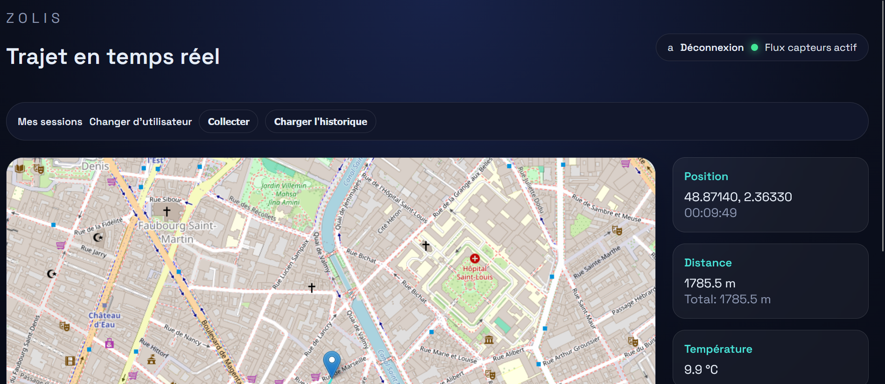

# Zolis - Guide rapide



## Prerequis
- Docker Desktop (ou Docker Engine + Docker Compose v2)
- Ports libres:
  - `5000` (frontend)
  - `1883` (MQTT)
  - `5432` (PostgreSQL)


PS: Le projet peut prendre environ 10 minutes voir plus avant que tous les services soient totalement lancés pour la première fois :)

## Lancement recommande (script)
### Bash (Linux / WSL / Git Bash)
```bash
bash scripts/start_project.sh
```

Options utiles:
```bash
# rebuild complet des images + recreation des conteneurs
bash scripts/start_project.sh --build

# suit les logs apres demarrage
bash scripts/start_project.sh --logs

# force le mode Thread strict (IPv6 only, sans fallback IPv4)
bash scripts/start_project.sh --strict-thread --build
```

### Python (cross-platform) 
```bash
python scripts/start_project.py   
```

Options equivalentes:
```bash
python scripts/start_project.py --build
python scripts/start_project.py --logs
python scripts/start_project.py --strict-thread --build
```

## Lancement manuel (sans script)
```bash
docker compose up -d db mqtt_broker coap-gps coap-batt coap-temp coap-leader coap-routeur backend frontend
```

## Verification rapide
```bash
docker compose ps
curl http://127.0.0.1:5000/api/backend/latest
curl -X POST http://127.0.0.1:5000/api/backend/collect
```

## Arret
```bash
docker compose down
```

## Reset complet (attention: supprime les volumes)
```bash
docker compose down -v
```

## Notes de debug rapides
- Si l'UI affiche `404` sur `/api/backend/latest`, la session web est souvent perimee: va sur `http://127.0.0.1:5000/logout` puis reconnecte-toi.
- Si `collect` renvoie `503`, attends 10 a 20 secondes (leader/routeur/capteurs CoAP peuvent finir de demarrer apres backend).
- Pour voir les logs utiles:
```bash
docker compose logs -f backend frontend coap-routeur coap-leader mqtt_broker db
```
